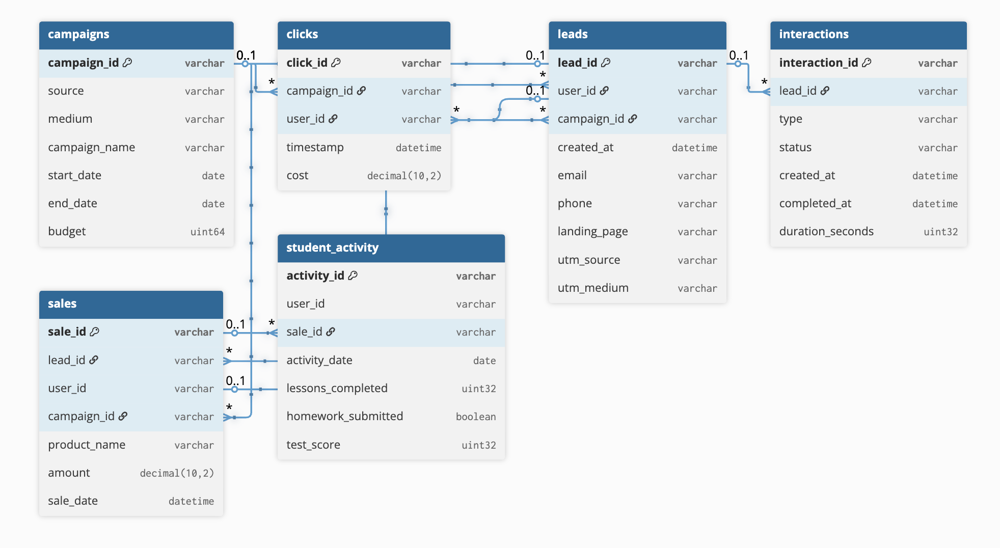
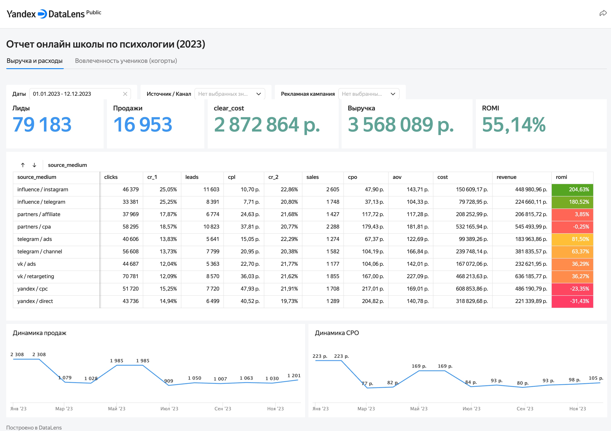
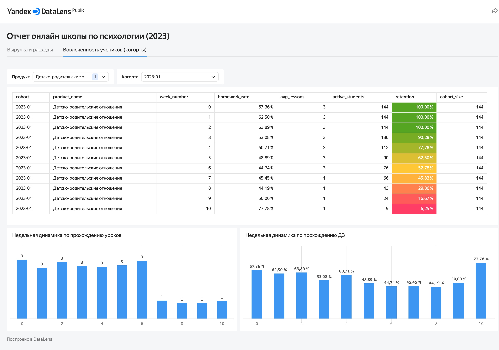

# Анализ маркетинговой эффективности и вовлеченности студентов онлайн-школы психологии

## Описание проекта
Комплексный анализ данных для онлайн-школы психологии. Цель проекта:
1. **Оценить эффективность маркетинговых каналов и кампаний:** построить воронку продаж от клика до продажи, рассчитать CAC, ROMI и выявить наиболее рентабельные источники трафика.
2. **Проанализировать вовлеченность студентов:** провести когортный анализ для оценки retention rate, вовлеченности в уроки и выполнения домашних заданий по различным продуктам школы.

**Стек технологий:**
* **Хранилище данных:** Yandex Cloud Object Storage
* **Аналитические запросы:** Yandex Query (YQL)
* **Визуализация:** Yandex DataLens
* **Версионирование:** Git, GitHub

## Структура данных
Исходные данные представляют собой эмуляцию работы CRM и системы обучения школы.

**Основные таблицы:**
* `campaigns` — рекламные кампании
* `clicks` — клики с атрибуцией и стоимостью
* `leads` — заявки (лиды)
* `interactions` — взаимодействия с лидами (звонки, встречи)
* `sales` — продажи
* `student_activity` — активность студентов после покупки

## Как воспроизвести анализ
1. **Ознакомьтесь со схемой данных:** [data/README.md](data/README.md)
2. **Изучите аналитическую логику:** все ключевые SQL-запросы находятся в папке [sql/](sql/).
   Основная логика заложена в:
    * [sql/02_sales_funnel_aggregation.sql](sql/02_sales_funnel_aggregation.sql) — формирование агрегата для воронки и ROMI.
    * [sql/03_retention_cohort_aggregation.sql](sql/03_retention_cohort_aggregation.sql) — формирование когортного отчета по retention.
4. **Посмотрите на результат:** скриншоты итоговых дашбордов находятся в папке [dashboards/](dashboards/).

## Ключевые выводы и рекомендации
Краткое резюме (подробнее в [conclusions/findings.md](conclusions/findings.md)):

### Маркетинг (Вкладка "Выручка и расходы")
* **Наиболее рентабельный канал:** `influence` (партнеры-эксперты) демонстрирует самый высокий ROMI за счет низкого CPO и высокой конверсии в продажу.
* **Проблемный канал:** `yandex.cpc` имеет высокую стоимость  лида (cpl) и низкую конверсию на этапе `lead -> sale`. Требуется аудит креативов и посадочных страниц.
* **Рекомендация:** Перераспределить часть бюджета с `yandex.cpc` на `influence`, где конверсия в лида стабильно выше.

### Продукт и удержание (Вкладка "Вовлеченность учеников")
* **Продукт "Психология денег":** показывает самый высокий retention на 4-й неделе (87%) по сравнению с другими курсами.
* **Рекомендация:** Внедрить систему "напоминаний" или дополнительную мотивацию для студентов на 3-й неделе обучения для всех когорт.

## Дашборды
### Вкладка 1: Выручка и расходы

* Интерактивная воронка продаж в разрезе источников/кампаний.
* Динамика ключевых метрик (CPO, CR, ROMI) по неделям.
* Таблица с детализацией по кампаниям.

### Вкладка 2: Вовлеченность учеников (когорты)

* Heatmap (таблица) retention rate по месячным когортам и неделям.
* Динамика завершенных уроков и сданных ДЗ.
* Срезы по продукту и конкретной когорте.

## Структура репозитория
online-school-analysis/
├── data/ # Описание данных и ER-диаграмма
├── sql/ # SQL-запросы для агрегации данных
├── dashboards/ # Скриншоты и описание дашбордов
├── conclusions/ # Бизнес-выводы и рекомендации
├── infrastructure/ # Описание инфраструктуры в Yandex Cloud
├── README.md # Вы читаете этот файл
└── LICENSE # Лицензия MIT

text

---
*Проект выполнен в учебных целях. Данные сгенерированы искусственно.*
